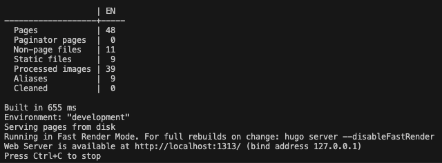
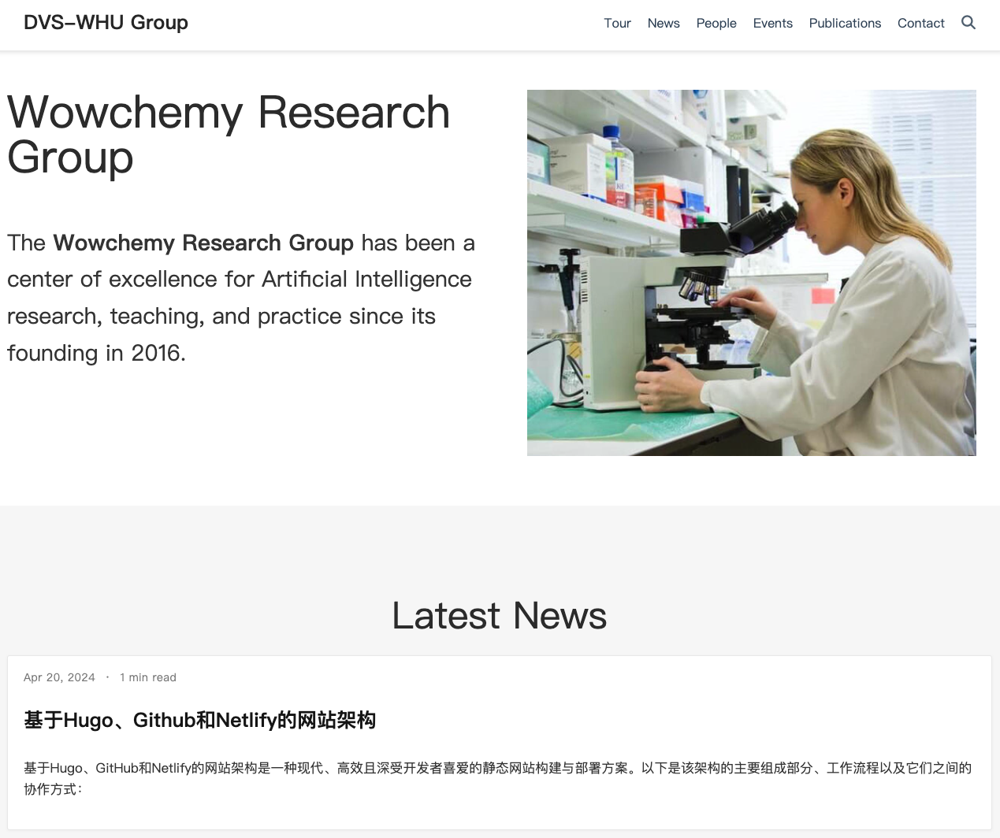

基于Hugo、GitHub和Netlify的网站架构是一种现代、高效且深受开发者喜爱的静态网站构建与部署方案。以下是该架构的主要组成部分、工作流程以及它们之间的协作方式：

<!--more-->

## **1. Hugo：静态网站生成器**

### **角色与功能**：

* **Hugo** 是一款开源、高性能的静态网站生成器，采用Go语言编写，以其快速构建速度和灵活性著称。
* 提供丰富的主题系统和模板引擎，使得用户能够快速设计出美观且响应式的网站界面，无需深入掌握前端开发技术。
* 支持Markdown等轻量级标记语言，便于内容创作者以文本格式编写文章、页面和元数据。
* 内置数据处理和内容管理功能，可处理多种数据源（如JSON、CSV、YAML等），便于集成动态内容或外部API数据。
* 提供命令行工具，通过简单的命令即可完成网站的创建、构建、本地预览及部署前的检查等工作。

### **工作流程**：

* 用户在本地计算机上[安装Hugo](https://gohugo.io/getting-started/quick-start/)并创建新站点。
* 设置漂亮的主题。本站选用了 `academic` 中的 [`Research Group` 主题](https://hugoblox.com/templates/details/research-group/)，将主题下载到本地，并解压缩到对应位置。
* 根据Hugo Blox介绍的方法，安装对应系统下的`go`和`git`软件，`cd`到主题目录，并在终端运行 `hugo server -D` 命令，Hugo将根据配置和模板生成纯HTML、CSS、JavaScript等静态文件，这些文件构成了最终可部署的网站。若显示如下信息，表示成功安装好了hugo和主题：
  
* 在浏览器中输入网址`http://localhost:1313/`就能看到生成的站点网页。
  
* 配置站点参数（如语言、主题、菜单、元信息等）以及内容目录结构。
* 使用Markdown撰写文章、创建页面，放置在指定目录下。

**2.**  **GitHub** **：版本控制系统与代码托管平台**

**角色与功能**：

* **GitHub** 是全球知名的分布式版本控制系统Git的云服务平台，用于存储、管理和协作开发代码、文本和其他数字资产。
* 作为网站源码的中央仓库，GitHub提供了版本控制、分支管理、合并请求、问题跟踪、文档存储等全套软件开发工具。
* 具有强大的社区支持和社交特性，鼓励开放源码、代码审查和知识共享。

**工作流程**：

* 用户在GitHub上创建一个新的公开或私有仓库，用于存放Hugo站点的源代码（包括内容、配置、主题文件等）。
* 使用Git客户端将本地Hugo站点与GitHub仓库关联，通过 `git add`, `git commit`, 和 `git push` 等命令将本地更改同步至云端。
* 在GitHub上进行版本控制、协同编辑、代码审查和问题讨论，确保网站源码始终保持最新且易于维护。

**3.**  **Netlify** **：静态网站托管与持续部署服务**

**角色与功能**：

* **Netlify** 是一个专注于静态网站托管、自动化构建、CDN分发、以及各种开发工具集成的云服务平台。
* 提供一键式部署功能，能够实时监测GitHub仓库的变动，当检测到新的提交时自动触发构建流程。
* 内置强大的构建流程管理（Build Plugins）和自定义脚本支持，可以灵活地扩展和定制构建过程。
* 提供全球CDN加速、HTTPS加密、自定义域名绑定、表单处理、Lambda Functions等高级功能，确保网站高性能、安全且易于扩展。

**工作流程**：

* 用户在Netlify上注册账号并连接到GitHub账户，授权访问所需的Hugo站点仓库。
* 创建新的Netlify站点，选择对应的GitHub仓库作为源码来源，并配置构建设置（如指定Hugo版本、构建命令等）。
* Netlify自动识别Hugo项目，并按照设定的构建流程执行 `hugo` 命令生成静态文件。
* 构建完成后，Netlify将生成的文件部署到其全球CDN网络，分配一个默认域名（或用户自定义域名）供访问。
* 今后每当GitHub仓库有新的提交，Netlify会自动触发构建更新，确保网站始终与源码保持同步。

综上所述，基于Hugo、GitHub和Netlify的网站架构实现了从内容创作、源码管理到自动构建、快速部署的全链路无缝衔接。这种架构充分利用了各自工具的优势，为用户提供了高效的内容发布流程、可靠的版本控制、便捷的协作环境，以及高性能、安全的网站托管服务，尤其适用于个人博客、项目文档、企业宣传等各类静态网站场景。
